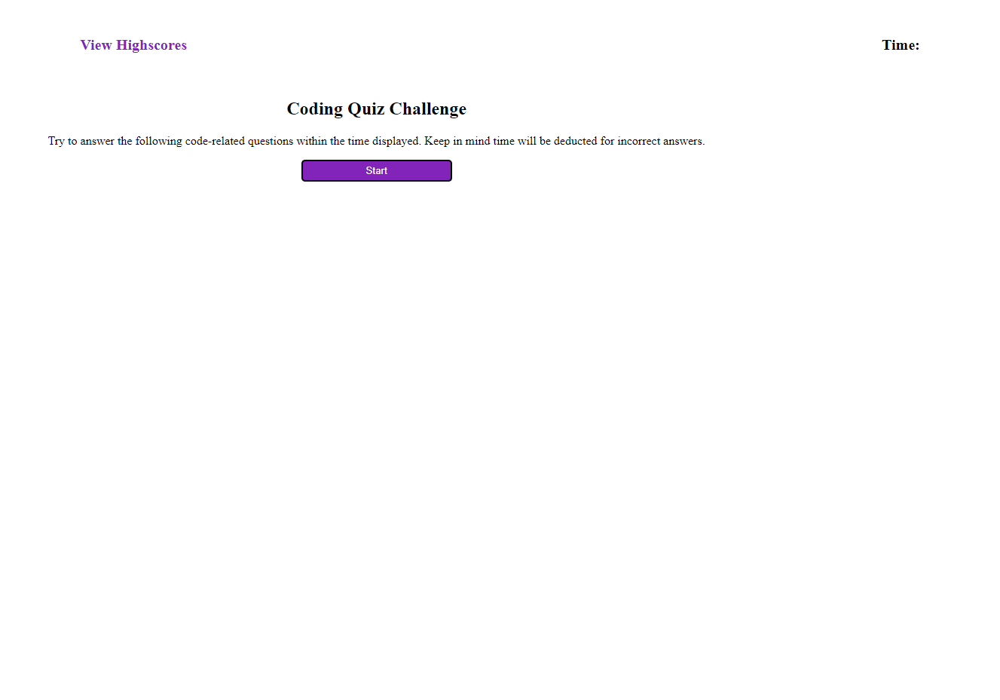

# JavaScript Fundamentals Quiz

## Description

This project was to create a quiz similar to coding assessments given during an interview process. It contains multiple-choice questions, runs in the browser and features dynamically updated HTML and CSS powered by JavaScript.

## Deployed Application

https://jrob02180.github.io/javascript-fundamentals-quiz/

